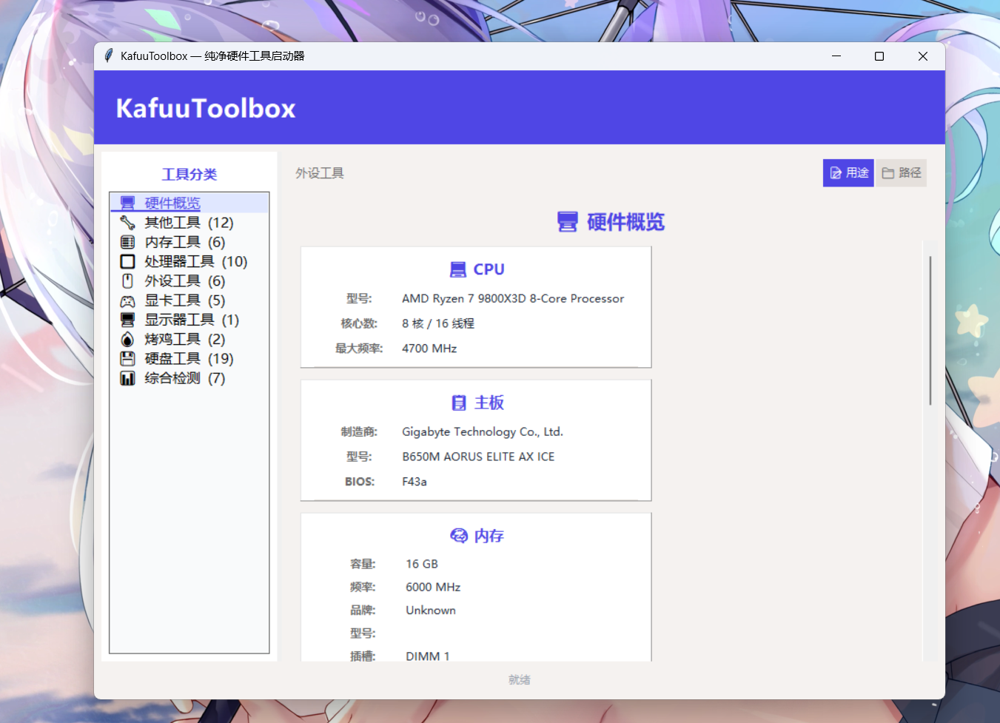

# KafuuToolbox

> 纯净硬件工具启动器 — 单文件 · 零捆绑 · 开源透明

[](https://www.python.org/)
[](LICENSE)
[](https://www.microsoft.com/windows)



---

## 为什么要写这个工具？

作为长期裸奔的技术人员，我习惯自己掌控系统。但在追查一次 GPU 黑屏问题时，意外发现系统被感染了 **Synaptics 蠕虫**。溯源后震惊地发现——携带蠕虫的安装包**全部来自"看起来正规"的渠道**：

| 来源 | 判定 |
|------|:--:|
| 第三方汉化版 GPU-Z | 🔴 无数字签名，携带 Synaptics |
| 别人给的比特彗星安装包 | 🔴 无数字签名，携带 Synaptics |
| cpuid.com 官网劫持期间的 CPU-Z | 🔴 无数字签名，携带 Synaptics |
| 别人给的 KMS 激活工具 | 🔴 携带 Synaptics |
| 官方 TechPowerUp GPU-Z | ✅ 有数字签名，安全 |
| 官方 CrystalDiskInfo/CPU-Z | ✅ 有数字签名，安全 |

**规律：有数字签名 = 安全，无数字签名 = 可能有毒。**

但普通用户不会逐个验证签名。所以我把这件事变成了代码——写一个透明的工具启动器，只做索引，不捆绑任何东西。

---

## 设计哲学

KafuuToolbox 不是图吧工具箱的复制品。它是从以下原则出发全新构建的：

1. **纯索引，零捆绑** — 不联网、不写注册表、不创建启动项、不捆绑任何 exe。工具来自官网，启动器只是索引导航
2. **透明优先** — 所有代码在一个 Python 文件里，每一行都公开可读
3. **便携优先** — 单 exe + 一个 `chino_bag/` 目录，U 盘/PE 系统即插即用
4. **不可替代的判断权** — 启动器帮你导航，但**验证签名这件事永远是你自己做**

---

## 快速开始

```
KafuuToolbox\
├── KafuuToolbox.exe       ← 双击运行
└── chino_bag\             ← 工具文件夹（按分类存放）
    ├── 处理器工具\
    ├── 显卡工具\
    ├── 内存工具\
    ├── 硬盘工具\
    ├── 烤鸡工具\
    ├── 显示器工具\
    ├── 综合检测\
    ├── 外设工具\
    ├── 其他工具\
    └── 游戏工具\
```

**工具从各自官网独立下载，右键验证数字签名后放入对应分类文件夹。** 启动器自动扫描并生成卡片。

---

## 功能

| 功能 | 说明 |
|------|------|
| 工具分类启动 | 自动扫描 10 大类、30+ 款工具，一键启动 |
| 硬件概览 | 实时获取 CPU/主板/内存/显卡/硬盘/显示器/DirectX 信息（通过 dxdiag CIM 查询） |
| 用途/路径切换 | 一键切换工具用途描述和文件路径 |
| 32/64位双版本 | 自动检测双版本工具并分别显示 |
| 优先选择 | Dism++/hwinfo/bluescreenview → x64, FurMark → GUI, CDM/CDI → Shizuku 皮肤版, 7-Zip → 7zFM |
| 管理员提权 | CPU-Z/GPU-Z/AIDA64 等自动弹 UAC |
| 进度条 + 缓存 | 硬件概览子线程加载，首次后缓存秒开 |
| 便携版 | 单 exe + 一个 chino_bag 目录，搬家即用 |

---

## 构建

```bash
pyinstaller --onefile --windowed --icon chino.ico --name KafuuToolbox KafuuToolbox.py
```

---

## 安全设计

| 机制 | 说明 |
|------|------|
| 零联网 | 启动器不发起任何 HTTP/HTTPS 连接 |
| 不写注册表 | 无启动项、无 COM 注册、无文件关联 |
| 只读文件系统 | 只扫描 `chino_bag/` 目录，不创建/修改任何文件 |
| 开源可审计 | 全部代码在 KafuuToolbox.py 中，任何用户可逐行验证 |
| 签名独立判断 | 每个工具须由用户从官网下载并验证签名——启动器不替你判断安全 |

---

## 背景：Synaptics 蠕虫事件

2026 年 6 月，在排查 GPU 黑屏问题时，发现系统被一个伪装成触摸板驱动（`Synaptics.exe`）的蠕虫感染：

- 释放路径：`C:\ProgramData\Synaptics\Synaptics.exe`
- 隐藏属性：系统文件 + 隐藏 (`-a-hs-`)
- 启动项：`Synaptics Pointing Device Driver` (HKCU + HKLM)
- 传播方式：捆绑在无签名的 GPU-Z 汉化版、比特彗星、CPU-Z 恶意版、KMS 激活工具中
- 检测结果：VirusTotal 64/69 报毒，Defender 7 次隔离记录
- 清杀工具：火绒凌晨扫描才发现 24 项感染扩散到 Excel 宏、微信缓存等隐蔽角落

**完整排查过程写入了 KafuuToolbox 的源码注释和技术背景中。**

---

## License

MIT — 使用、修改、分发均自由。

## Author

KafuuTech & ClawX · 2026 · 凌晨三点半

**验证数字签名，比任何杀毒软件都可靠。火绒能帮你扫角落，但签名判断永远是你自己的眼睛。**
